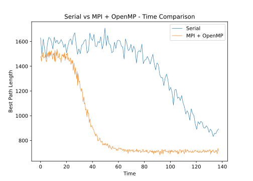

# Ant Colony Optimization for TSP
This is a C++ implementation of the Ant Colony Optimization algorithm for the Travelling Salesman Problem. The code is parallelized using MPI and OpenMP.

This project was done as the final project for "High Performance Computing for Data Science" course at the [University of Trento](https://www.unitn.it/en) by [Seyed Mohammad Mousavi](https://github.com/SMMousaviSP) and [Michele Marchi](https://github.com/TunaInABottle). The code was tested on the [High Performance Computing Cluster of the University of Trento](https://sites.google.com/unitn.it/hpc/). The commands for compiling the code is tuned for this specific cluster and might not work on other clusters. The version of the compiler used is `g++ (GCC) 4.8.5 20150623 (Red Hat 4.8.5-36)`.

<p align="center">
  
</p>

## Running the Serial Code
For running the serial code, compile the `aco.cpp` in the `src` directory with `g++` and then run it.
```bash
g++ aco.cpp
./a.out
```

## Running on the HPC Cluster
Create the `env` directory in `src`. Move pbs script from `pbs` directory to
the `env` directory. On the last line of the pbs script give the absolute path
of your compiled code.
Be careful as the `env` directory will be ignored by git.
Run the following command to compile the code.
```bash
mpic++ -std=c++0x -g -Wall -o env/acompi.out acompi.cpp
```
Then go to the `env` directory and run the following command to submit the job
to the cluster.
```bash
qsub acompi_pbs.sh
```
